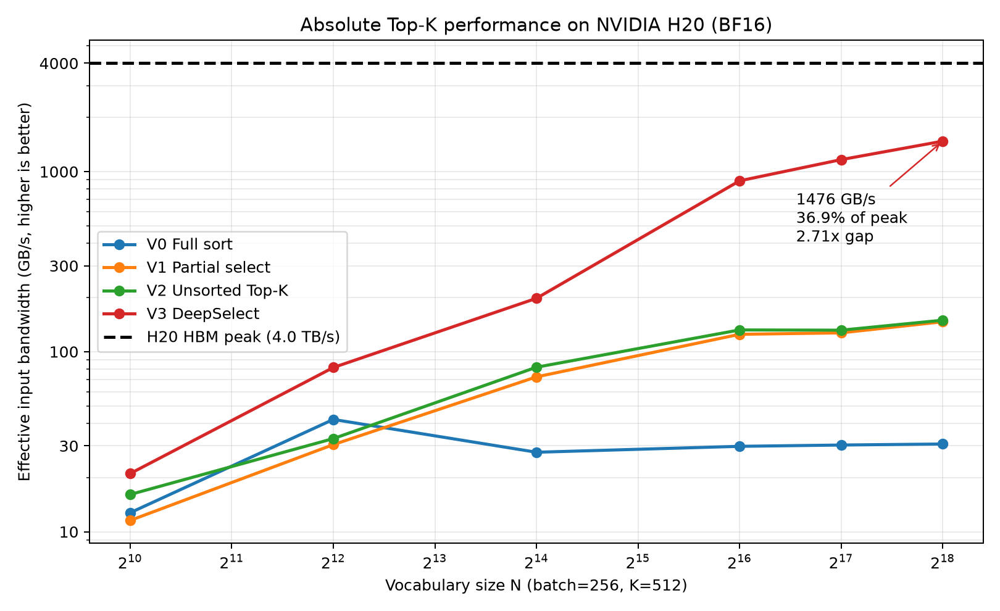

# H20 BF16 Top-K 教学仓库

本仓库在 NVIDIA H20（`sm_90a`）上把 Top-K 拆成可累积的优化阶段，并用 CUDA Event 实测每一步。统一契约为二维 BF16 输入、`K=512`、BF16 values、INT64 indices、`sorted=False`。

## 优化阶段

- **V0：完整排序**。`torch.sort` 对全部 N 个元素排序后取前 K。
- **V1：部分选择**。`torch.topk(sorted=True)` 只选择 Top-K，但仍保证输出有序。
- **V2：无序 Top-K**。`torch.topk(sorted=False)` 省去最终 K 个结果的排序。
- **V3A：基础 DeepSelect**。精确初始 Top-K、scan/filter/radix-select；shared atomic 分配候选槽位，串行 TMA，累计约 4096 个候选后重构。
- **V3B：ballot 压缩**。只用 warp ballot、popcount 和 CTA prefix 替换 shared atomic，其余配置不变。
- **V3C：TMA 流水线**。只加入多缓冲预取，让后续数据搬运与当前轮候选处理重叠。
- **V3D：自适应门槛**。长行累计约 1024 个候选便提前重构 Top-K，更早提高过滤门槛。
- **V3E：自适应调度**。生产版根据 GPU wave 数选择 256/512 threads、每轮 4096/8192 元素和 TMA 深度。
- **V3F：thread-block cluster**。C2/C4/C8 个 CTA 分段扫描同一行，各自产生 local Top-K，经 DSM 汇总到 CTA0 做最终 global Top-K。

H20 对这些精确内核报告的最大可运行 cluster size 为 **8**，因此不构建 C16。C2/C4/C8 均通过独立进程 canary、完整值/索引校验和重复 DSM 同步测试。

### DeepSelect 整体逻辑

normal V3 每一行由一个 CUDA 线程块处理。几百个线程分段扫描输入，每个线程每轮检查 16 个数，因此一个 CTA 可以同时处理几千个元素。内核始终准确保留当前已扫描区域的 K 个最大值，并把其中最小值作为门槛；后续元素只有超过门槛才写入临时候选区。

候选积累到重构阈值后，内核从“原来的 K 个结果 + 新候选”中用 radix-select 再选出 K 个最大值。新门槛只会保持或提高，因此过滤会越来越严格，同时不会出现门槛过高导致最终不足 K 个的问题。V3B–V3E 分别优化候选写入、数据搬运、门槛更新时间和 CTA 配置；V3F 则进一步让多个 CTA 并行扫描同一行。

## 实测结论

主图固定 `batch=6, K=512`，覆盖 `64K` 到 `4M` 宽度，每点 20 次预热、50 次 CUDA Event 测量。表中性能是完整宽度矩阵的几何平均有效输入带宽；normal 阶段与前一版本比较，cluster 统一与 V3E 比较。

| 版本 | 几何平均带宽 | 相对性能 |
|---|---:|---:|
| V0 | 20.7 GB/s | — |
| V1 | 49.7 GB/s | 2.40x |
| V2 | 56.6 GB/s | 1.14x |
| V3A | 58.6 GB/s | 1.04x |
| V3B | 54.9 GB/s | 0.94x |
| V3C | 82.9 GB/s | 1.51x |
| V3D | 84.0 GB/s | 1.01x |
| V3E | 102.7 GB/s | 1.22x |
| V3F C2 | 114.6 GB/s | 1.12x vs V3E |
| V3F C4 | 157.5 GB/s | 1.53x vs V3E |
| V3F C8 | 194.8 GB/s | 1.90x vs V3E |

多缓冲 TMA 流水是 normal 消融中最大的单步收益。Ballot 压缩在当前 H20、K=512、batch=6 矩阵中反而下降约 6%，这一负收益也如实保留。最终 V3E 相比 V0 平均快 `4.96x`，C8 相比 V0 平均快 `9.41x`。在 `N=4M` 时，C8 达到 `717.2 GB/s`，是 V3E 的 `3.88x`。

完整矩阵几何平均选择 **C8** 作为固定 V3F，不逐点拼接最优 cluster size。详细算法、资源数据和逐阶段表格见 [TOPK_OPTIMIZATION.md](TOPK_OPTIMIZATION.md)。

## 构建与运行

验证环境为 NVIDIA H20、CUDA 12.8、PyTorch 2.7：

```bash
./run_h20.sh build
./run_h20.sh benchmark
./run_h20.sh plot
```

也可直接构建：

```bash
DEEP_SELECT_CUDA_ARCHS=90a python3 setup.py build_ext --inplace
```

`deep_select.topk()` 保持生产入口；教学消融通过 `deep_select.benchmark_topk(..., variant=...)` 调用。`plot` 会更新包含原始 CUDA Event 样本的 [assets/topk_h20_stages.json](assets/topk_h20_stages.json) 和单坐标图 [assets/topk_h20_stages.png](assets/topk_h20_stages.png)。

## H20 绝对带宽



纵轴是“输入字节数 / 中位延迟”的有效输入带宽。H20 HBM 理论峰值按 `4000 GB/s` 绘制，它是输入只读一次的理想屋顶线，不是硬件计数器测得的实际流量。

## 来源与许可证

CUDA 实现裁剪自上游 [DeepSeek-AI/DeepSelect](https://github.com/deepseek-ai/DeepSelect)。项目采用 [MIT License](LICENSE)；内含 CUTLASS 与 Kerutils 的许可证或来源说明。
